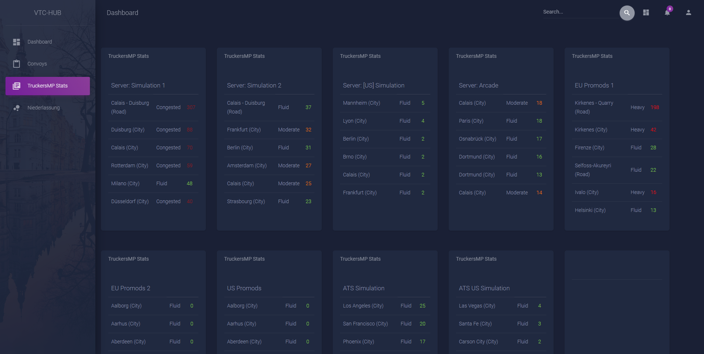

<!--
*** Thanks for checking out this README Template. If you have a suggestion that would
*** make this better, please fork the repo and create a pull request or simply open
*** an issue with the tag "enhancement".
*** Thanks again! Now go create something AMAZING! :D
-->

<!-- PROJECT SHIELDS -->
<!--
*** I'm using markdown "reference style" links for readability.
*** Reference links are enclosed in brackets [ ] instead of parentheses ( ).
*** See the bottom of this document for the declaration of the reference variables
*** for contributors-url, forks-url, etc. This is an optional, concise syntax you may use.
*** https://www.markdownguide.org/basic-syntax/#reference-style-links
-->

<!-- PROJECT LOGO -->
 

  

  

  <h3 align="center"><b>VTC-Hub (SpedV)</b></h3>

<!-- TABLE OF CONTENTS -->
## Table of Contents

  * [Built With](#built-with)
  * [Installation](#installation)
* [License](#license)
* [Contact](#contact)

<!-- ABOUT THE PROJECT -->

### Built With

* [Bootstrap](https://getbootstrap.com)
* [PHP](https://www.php.net/)

<!-- GETTING STARTED -->

### Installation
Um die SpedV Statistiken zu benutzen wird ein API-Key gebraucht, den du mit SpedV+ erstellen kannst

<!-- USAGE EXAMPLES -->

<!-- ROADMAP -->

<!-- CONTRIBUTING -->
## ToDo
- [ ] Adminbereich
- [ ] RSS-Feed Seite
- [ ] Pofilseite
- [ ] Wartunsübersicht (SpedV)

<!-- LICENSE -->
## License

Distributed under the MIT License. See `LICENSE` for more information.

<!-- CONTACT -->
## Contact

Twitter: [@Elten78912524](https://twitter.com/Elten78912524) Discord: Elten#7272

Project Link: [https://github.com/xElten/VTC-Hub-SpedV](https://github.com/xElten/VTC-Hub-SpedV)

<!-- MARKDOWN LINKS & IMAGES -->
<!-- https://www.markdownguide.org/basic-syntax/#reference-style-links -->

